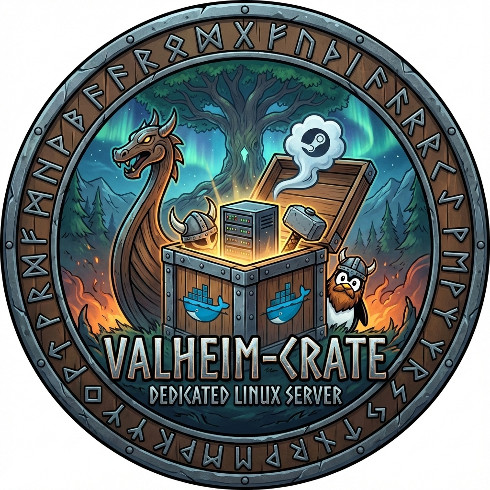

# Valheim-Crate

<div align="center">
  
</div>

🐳 **基于 Docker 的 Valheim 专用服务器** — 零配置，在 Linux 上运行。

[English Documentation](README.md)

## 功能特性

- ✅ 一键安装
- ✅ 自动更新
- ✅ 完整配置支持（所有 Valheim 服务器选项）
- ✅ 世界修改器（预设、自定义修改器、种子）
- ✅ 数据持久化
- ✅ 双语支持（中英文）

## 系统要求

- Linux（在 Ubuntu/Debian 上测试）
- Docker 和 Docker Compose
- 2GB+ 可用磁盘空间
- 网络访问

## 快速开始

```bash
git clone <repository-url>
cd Valheim-Crate
cp docker-compose.example.yml docker-compose.yml
nano docker-compose.yml  # 设置 SERVER_NAME 和 SERVER_PASSWORD
./server.sh install
```

## 命令

| 命令 | 说明 |
|-----|------|
| `install` | 首次安装（构建、创建、安装、启动） |
| `update` | 更新服务器文件（不重建） |
| `start` | 启动服务器（如需要会自动安装） |
| `stop` | 停止服务器 |
| `restart` | 重启服务器 |
| `status` | 显示服务器状态 |
| `remove` | 删除容器/镜像（数据保留） |

**默认：** `./server.sh`（等同于 `start`）

## 配置

编辑 `docker-compose.yml`（从 `docker-compose.example.yml` 复制）。所有设置通过环境变量完成。

**注意：** `docker-compose.yml` 已被 gitignore 忽略，以保护您的密码。

### 必填

```yaml
environment:
  SERVER_NAME: "Your Server Name"
  SERVER_PASSWORD: "YourPassword"
```

### 基础

```yaml
environment:
  SERVER_PORT: 2456              # 默认：2456
  SERVER_WORLD: "Dedicated"       # 默认：Dedicated
  SERVER_PUBLIC: 1                # 1=公开，0=私有
  SERVER_SAVE_DIR: "/valheim/saves"
  SERVER_LOGFILE: "/valheim/log.txt"
  SERVER_SEED: "your-seed"        # 可选，不设置则随机
```

### 世界修改器

**选项 1：预设（推荐新手）**
```yaml
SERVER_PRESET: "hard"  # Normal, Casual, Easy, Hard, Hardcore, Immersive, Hammer
```
默认：Normal（如果不设置）

**选项 2：自定义修改器**
```yaml
SERVER_MODIFIER: "raids:none,combat:hard,resources:more"
```
| 可用 | 值 |
| combat | veryeasy, easy, hard, veryhard |
| deathpenalty | casual, veryeasy, easy, hard, hardcore |
| resources | muchless, less, more, muchmore, most |
| raids | none, muchless, less, more, muchmore |
| portals | casual, hard, veryhard |

**选项 3：复选框键**
```yaml
SERVER_SETKEY: "nomap,nobuildcost"  # nobuildcost, playerevents, passivemobs, nomap
```

**组合：**
- ✅ `SERVER_MODIFIER` + `SERVER_SETKEY`（推荐）
- ⚠️ `SERVER_PRESET` + `SERVER_MODIFIER`（预设会覆盖修改器）

### 高级

```yaml
SERVER_SAVEINTERVAL: 1800    # 保存间隔（秒，默认：1800）
SERVER_BACKUPS: 4            # 备份数量（默认：4）
SERVER_BACKUPSHORT: 7200     # 短期备份间隔（默认：7200）
SERVER_BACKUPLONG: 43200     # 长期备份间隔（默认：43200）
SERVER_CROSSPLAY: 1          # 启用跨平台（0=仅 Steam，1=跨平台）
SERVER_INSTANCEID: "1"       # 多个服务器的唯一 ID
```

## 数据与端口

**数据位置：** `/opt/server/valheim`（删除容器后仍保留）

**端口转发：**
- Steam 后端（默认）：转发 UDP 2456-2457
- 跨平台（`SERVER_CROSSPLAY: 1`）：不需要

## 日志

```bash
docker-compose logs -f valheim                    # 容器日志
docker-compose exec valheim cat /valheim/log.txt  # 服务器日志（如果配置了）
```

## 故障排除

- **服务器无法启动：** 检查 `./server.sh status` 并验证 `SERVER_NAME`/`SERVER_PASSWORD` 已设置
- **服务器文件未找到：** 运行 `./server.sh install`
- **端口冲突：** 在 `docker-compose.yml` 中更改端口
- **更新失败：** 运行 `./server.sh start && ./server.sh update`

## 项目结构

```
📦 Valheim-Crate/
├── 🐳 Dockerfile                 # Docker 镜像定义
├── 📝 docker-compose.example.yml  # 示例配置文件（复制为 docker-compose.yml）
├── 🚫 docker-compose.yml          # 您的本地配置（已 gitignore）
├── 🎮 server.sh                   # 主管理脚本
├── 📚 README.md                   # 英文文档
├── 📚 README.zh.md                # 中文文档
├── 🚫 .gitignore                  # Git 忽略规则
└── 📁 scripts/
    ├── ⚙️  setup.sh               # 安装/更新服务器文件
    └── 🚀 start.sh                # 启动 Valheim 服务器
```

本项目按原样提供，用于运行 Valheim 专用服务器。
